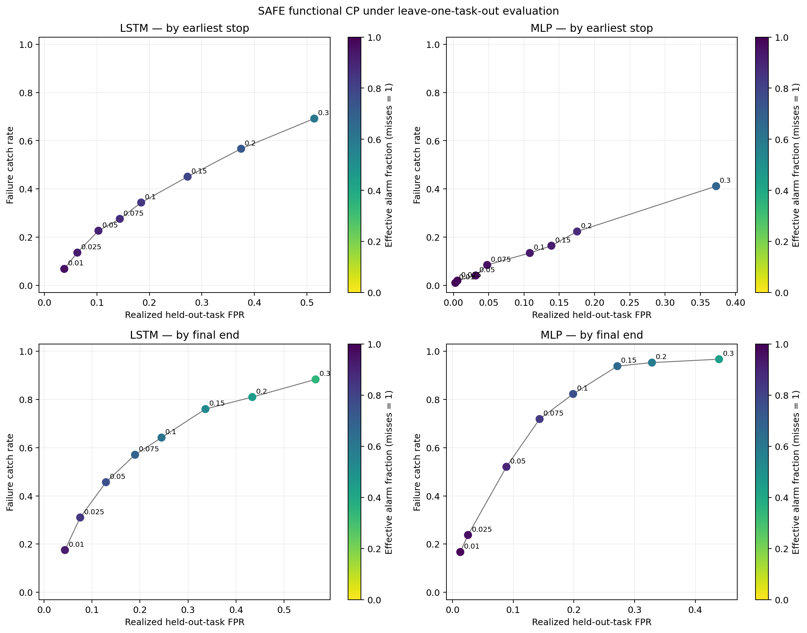

# extend-SAFE

> **Pooled ROC-AUC (0.747 / 0.755) does not imply reliable early failure warning
> on unseen tasks.** Under 10-fold LOTO with SAFE functional conformal
> calibration at ≤5% realized FPR, catch rate is only 8.5% (MLP) / 6.9% (LSTM)
> with mean alarm at 95.5% of the evaluation window.

<p align="center">

</p>

This repository is a reproducible audit of SAFE-style failure detection over
OpenVLA representations on ten LIBERO tasks. Its main finding is deliberately
narrow: **in this reproduction, strong pooled ROC-AUC does not imply timely,
low-false-positive warning on an unseen task.**

The finalized 1,000-rollout layer-32 probes obtain pooled early-window AUCs of
0.747 (MLP) and 0.755 (LSTM), but equal-task LOTO AUCs are 0.672 and 0.652. At
the best tested SAFE functional-conformal operating points with at most 5%
realized FPR, they catch only 8.5% and 6.9% of held-out-task failures.

Read the GitHub-rendered [technical report](docs/safe_openvla_audit.md), its
[Quarto source](docs/safe_openvla_audit.qmd), or the explicit
[closeout requirements](docs/CLOSEOUT_REQUIREMENTS.md).

## Reproduce the public audit

Install the exact tested environment:

```bash
uv sync --frozen --extra dev
```

The planned public score bundle contains only detector trajectories and rollout
metadata—not OpenVLA hidden states. After it is generated from the two source
rollout shards, it replays the original and fixed-horizon functional-CP
analyses:

```bash
uv run python scripts/evaluate_functional_cp_loto.py \
  --score-bundle-in docs/results_audit/score_bundle \
  --output-dir reproduced/functional_cp_loto \
  --fixed-horizons 50,100,148

uv run python scripts/compare_functional_cp_outputs.py \
  --expected-root docs/results_audit \
  --actual-root reproduced/functional_cp_loto
```

Validate code and publication artifacts with:

```bash
uv run pytest -q
uv run python scripts/verify_publication.py
```

See [DATA.md](DATA.md) for the full-inference input contract and
[the score-bundle specification](docs/SCORE_BUNDLE.md) for the compact replay
format.

## Scope

- Primary result: 1,000 rollouts, 100 per task, ten LOTO folds.
- Policy/benchmark: OpenVLA on ten LIBERO tasks.
- Primary monitors: SAFE-style layer-32 MLP and LSTM probes.
- Secondary layer-20/32 result: 1,000 rollouts, 100 per task, ten LOTO folds,
  and three training seeds. Capacity-matched fusion does not improve AUC
  (-0.004; 95% task-bootstrap CI [-0.020, 0.012]) or fixed-horizon warning.
  A residual model improves one retrospective warning operating point, but not
  the predeclared fixed horizons, so it remains exploratory. The original
  450-rollout, nine-task layer-24/28/32 signal now has an independent
  500-rollout, ten-task replication: its AUC point estimates reproduce, but the
  direct interval remains unresolved and warning utility does not improve.
- The repository does not claim that SAFE fails for every policy, benchmark,
  or failure-label regime.

## Project status

The main scientific conclusion is stable at the scope above, and open
limitations and non-goals are recorded in the report. The public score bundle
replays the original and fixed-horizon functional-CP analyses; the
predeclared 50/100/148-step sensitivity is included. Compact result tables live
under `docs/results_audit/`; raw rollouts, checkpoints, and development runs are
intentionally excluded.

## License and citation

Original repository code is released under the [MIT License](LICENSE).
Third-party models, benchmarks, papers, and data retain their own terms; see
[THIRD_PARTY.md](THIRD_PARTY.md). Citation metadata are in
[CITATION.cff](CITATION.cff).
