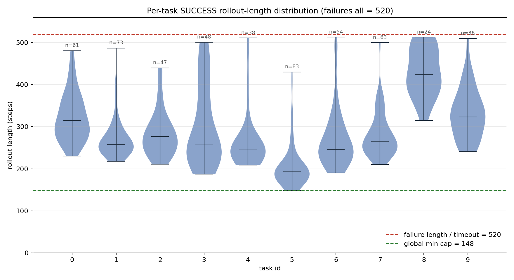
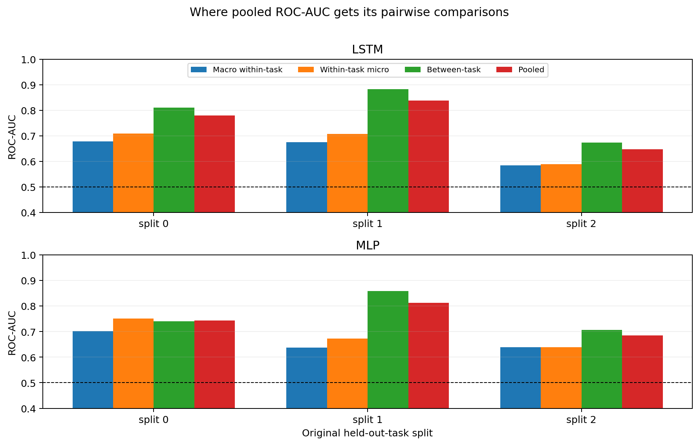
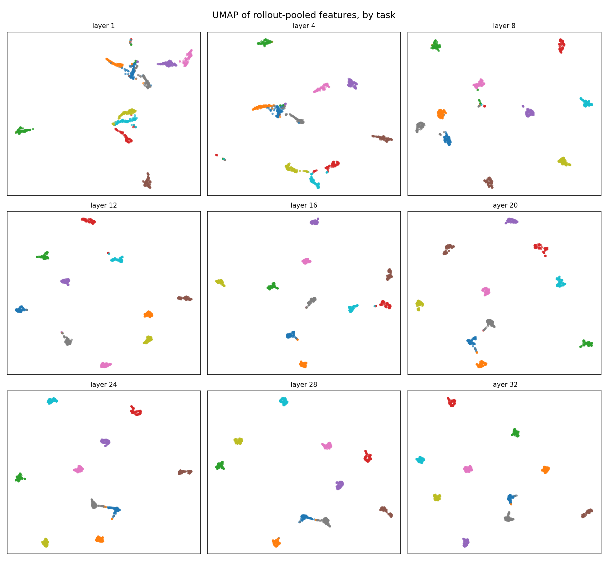

## Abstract

[SAFE](https://arxiv.org/abs/2506.09937) proposes failure probes over frozen
vision-language-action (VLA) representations and evaluates transfer to unseen
tasks. We reproduced the OpenVLA/LIBERO probe setting and then hardened the
evaluation around the deployment question: **does the detector warn early on an
unseen task while maintaining an acceptable false-positive rate?**

On 1,000 rollouts from 10 LIBERO tasks, the SAFE-style pooled early-window
ROC-AUC is strong (0.747 for MLP and 0.755 for LSTM), but macro within-task AUC
is lower (0.660 and 0.646). An exact pair decomposition explains why: 71.1% of
the comparisons entering pooled AUC are cross-task comparisons, and those
comparisons are easier than within-task comparisons. Under 10-fold
leave-one-task-out (LOTO), macro early-window AUC is 0.672 for MLP and 0.652 for
LSTM, with wide variation across tasks.

The decisive test is SAFE's time-varying functional conformal procedure under
LOTO. At operating points with at most 5% realized false-positive rate, the
benchmark-compatible earliest-stop evaluation catches only 8.5% of failures
for MLP and 6.9% for LSTM. Counting missed failures as alarm-at-end, the mean
alarm position is 95.5% and 95.7% of the evaluation window. Even when the full
rollout is available, the corresponding catch rates are only 23.8% and 17.5%.
Reaching roughly 50% catch requires 8.9% realized FPR for MLP and 19.0% for
LSTM, and warnings remain late.

The evidence is strong enough for a narrow conclusion: **in this reproduction,
pooled ROC-AUC does not imply reliable, timely, cross-task failure warning.** It
does not establish that SAFE is invalid in every policy, benchmark, or data
regime.

## 1. Evidence selection

This report does not treat every generated artifact as equally probative. The
featured evidence was selected for held-out-task validity, resistance to the
known timeout shortcut, statistical transparency, and reproducibility from
saved checkpoints.

| Evidence | Assessment | Use in this report |
|---|---|---|
| Functional CP under 10-fold LOTO, 10 CP splits, 8 alpha values | **Primary.** Directly tests false alarms, failure coverage, and warning time with SAFE's functional procedure. | Headline result |
| LOTO `falert_early` AUC on all 10 tasks | **Primary.** Every task is held out once; task bootstrap exposes heterogeneity. | Headline result |
| Exact pooled-AUC pair decomposition on finalized checkpoints | **Primary mechanism, limited population inference.** Exact for the observed splits; only three held-out tasks per original split. | Headline explanation with caveat |
| Rollout-length distribution and length-only AUC | **Primary diagnostic.** Directly establishes the timeout shortcut in uncapped evaluation. | Headline diagnostic |
| Incremental layer-value tests under LOTO | **Strong secondary negative result.** Tests whether extra layers improve held-out AUC; uncertainty is reported. | Supporting result |
| CKA and UMAP latent geometry | **Explanatory only.** Useful for diagnosing task structure, but embeddings are not evidence of detector performance. | Appendix/support |
| Fixed-timestep and progress-proxy analyses | **Supporting.** Useful disentanglement checks, but less direct than the final LOTO functional-CP evaluation. | Not headlined |
| Earlier constant-threshold detection-time tables | **Superseded.** They used a simpler split-conformal threshold rather than SAFE's functional procedure. | Excluded from conclusions |
| Pilot 500-rollout and undertrained runs | **Development evidence.** Valuable for generating hypotheses, not for final effect sizes. | Excluded from conclusions |

Earlier prose drafts and their constant-threshold conformal tables were
consolidated into this report. Their older conformal numbers are superseded by
`evaluate_functional_cp_loto.py`.

## 2. Scope and experimental setup

### 2.1 Policy, benchmark, and rollouts

- Policy: [OpenVLA](https://arxiv.org/abs/2406.09246).
- Benchmark: 10 tasks from [LIBERO](https://arxiv.org/abs/2306.03310).
- Data: 1,000 rollouts, exactly 100 per task; 527 successes and 473 failures.
- Sources: `data/rollouts/openVLA-last-layer` and
  `data/rollouts/openVLA-last-layer-2`, each containing 500 distinct rollouts.
- Representation: the last action-token hidden state, with layer 32 used for
  the final detector comparison. The layer-complementarity study uses layers
  1, 4, 8, 12, 16, 20, 24, 28, and 32.

The two rollout shards use different historical storage schemas: the first
preserves the action-token axis and the second stores an already-selected last
token. `MixedSchemaLayerDataset` reads both without rewriting the source files
and exposes a common 4,096-dimensional layer-32 trajectory.

### 2.2 Detectors and splits

The finalized layer-32 probes use the paper-selected OpenVLA settings:

| Probe | Learning rate | Regularization | Architecture |
|---|---:|---:|---|
| SAFE-MLP | 1e-4 | 1e-2 | two-layer MLP, cumulative-sum score |
| SAFE-LSTM | 1e-4 | 1 | one-layer LSTM, all-history score |

Generalization is evaluated with 10 LOTO folds. Fold *k* trains and calibrates
on the other nine tasks, then tests on task *k*. Every reported LOTO macro value
first aggregates within held-out task and then averages equally across the 10
tasks.

### 2.3 Keep training, ranking, and calibration separate

Three stages answer different questions:

1. **Probe training** produces a scalar failure score trajectory from frozen
   hidden states.
2. **Ranking evaluation** computes ROC-AUC from a rollout score. The primary
   score, `falert_early`, is the maximum score up to the task's shortest rollout
   (`task_min_step`). `falert_end` uses the full rollout.
3. **Conformal calibration** converts score trajectories into time-varying
   alarm thresholds. It governs thresholded metrics such as realized FPR,
   failure catch rate, and detection time; it does not explain ROC-AUC.

The earliest-stop cap follows SAFE's benchmark evaluation, but it is
retrospective: it uses a per-task minimum rollout length known from the dataset.
It is therefore a useful comparability check, not a deployable stopping policy.
The full-end evaluation is also reported, but it is vulnerable to elapsed-time
and survival information.

## 3. Results

### 3.1 The outcome label is perfectly recoverable from rollout length

Every failed rollout lasts exactly 520 steps, whereas successful rollouts may
terminate earlier. Consequently, a length-only classifier obtains ROC-AUC 1.0
for every held-out task. This does not make early-window evaluation invalid; it
does make uncapped, full-rollout discrimination a poor measure of early semantic
failure detection.

{fig-alt="Violin plots of successful rollout lengths for ten tasks, all below or approaching the 520-step line used by every failure."}

This diagnostic is the reason the report treats `falert_early` and functional
alarm timing as primary, and `falert_end` as a sensitivity analysis.

### 3.2 Pooled AUC is dominated by cross-task comparisons

ROC-AUC is a pairwise ranking statistic. When rollouts from several tasks are
pooled, most failure-success pairs come from different tasks. Those pairs can be
ranked correctly because of task-dependent score scale, failure prevalence, or
trajectory structure even when within-task ranking is only modest.

| Probe | Pooled AUC | Macro within-task | Within-task micro | Between-task AUC | Cross-task pair share | Pooled - macro |
|---|---:|---:|---:|---:|---:|---:|
| MLP | 0.747 | 0.660 | 0.688 | 0.768 | 71.1% | +0.087 |
| LSTM | 0.755 | 0.646 | 0.668 | 0.789 | 71.1% | +0.109 |

{fig-alt="Grouped bars show that between-task AUC exceeds macro within-task AUC in all three splits for both LSTM and MLP."}

For each model and split, the decomposition is exact: pooled AUC is the
pair-count-weighted average of within-task and between-task pair accuracy. The
observed gap is positive in all six model-split combinations. Split 1 is the
clearest case: task 8 has a high failure rate and high detector scores, while
tasks 5 and 7 have more successes and lower score scales, making cross-task
pairs especially easy.

The inferential boundary matters. Each original split contains only three
held-out tasks. A task-clustered, label-stratified bootstrap gives intervals for
the pooled-minus-macro gap that overlap zero within each split. The decomposition
therefore establishes the **mechanism in these observed splits**, but the report
does not claim a precisely estimated population-wide inflation constant.
The per-split values and bootstrap intervals are preserved in
[`pair_decomposition_by_split.csv`](results_audit/pair_decomposition_by_split.csv)
and
[`pair_decomposition_bootstrap_summary.csv`](results_audit/pair_decomposition_bootstrap_summary.csv).

### 3.3 LOTO performance is modest and task dependent

| Probe | LOTO macro early AUC | 95% task-bootstrap CI | Across-task SD | Task range |
|---|---:|---:|---:|---:|
| MLP | 0.672 | [0.599, 0.738] | 0.113 | 0.413-0.817 |
| LSTM | 0.652 | [0.580, 0.730] | 0.123 | 0.476-0.870 |

The variation is operationally important. Both probes are below chance on task
5, while tasks 0 and 7 are comparatively easy. A pooled score cannot expose
this failure mode because task-dependent scale contributes to the pooled
ranking. The full per-task table is available in
[`loto_per_task_auc.csv`](results_audit/loto_per_task_auc.csv).

### 3.4 SAFE functional conformal prediction does not yield a useful operating point

We reimplemented the official functional-conformal path used by SAFE:

- take successful seen-task validation score trajectories;
- extend-align variable-length trajectories to a fixed 520-step horizon;
- randomly split successful calibration trajectories 30/70;
- fit the mean trajectory and SAFE `Tfunc` modulation on the first portion;
- calibrate a one-sided upper band on the second portion;
- alarm at the first threshold crossing on the unseen held-out task.

The evaluation sweeps 8 alpha values and repeats the random 30/70 functional-CP
split for 10 seeds. Within each held-out task we average over CP seeds; across
tasks we report an equal-weight macro mean and a 10,000-replicate task
bootstrap.

{fig-alt="Four tradeoff plots for LSTM and MLP at earliest-stop and full-end evaluation. Low false-positive points have low catch rates and late effective alarms."}

The most informative constraint-selected points are:

| Evaluation | Probe | Selection rule | Alpha | Realized FPR | Failure catch | Effective alarm position |
|---|---|---|---:|---:|---:|---:|
| Earliest stop | MLP | best point with FPR <= 5% | 0.075 | 4.8% | 8.5% | 95.5% |
| Earliest stop | LSTM | best point with FPR <= 5% | 0.010 | 3.8% | 6.9% | 95.7% |
| Full end | MLP | best point with FPR <= 5% | 0.025 | 2.6% | 23.8% | 96.2% |
| Full end | LSTM | best point with FPR <= 5% | 0.010 | 4.4% | 17.5% | 91.8% |
| Full end | MLP | lowest-FPR point with catch >= 50% | 0.050 | 8.9% | 52.0% | 89.6% |
| Full end | LSTM | lowest-FPR point with catch >= 50% | 0.075 | 19.0% | 57.0% | 68.4% |

"Effective alarm position" is the first-alarm fraction for caught failures and
1.0 for missed failures. This prevents a misleading caught-only summary: a
detector can appear early by catching a small, easy subset while missing most
failures. Under earliest-stop evaluation, LSTM needs 37.5% realized FPR to catch
56.7% of failures; MLP never reaches 50% catch in the tested alpha range.

The conclusion is stable across CP split seeds, but transfer is heterogeneous
across tasks. For example, at nominal alpha 0.01 the LSTM earliest-stop FPR is
near zero on several tasks but 29.6% on task 2. Functional conformal calibration
on seen tasks therefore should not be described as a uniform guarantee on a new
task.

## 4. Supporting findings

### 4.1 Extra layers do not provide a reliable held-out gain

The layer study asks a stricter question than whether layer representations are
different: does layer *k* improve unseen-task AUC after the layer-32 detector
score is already known? A logistic combiner is fit on seen tasks using either
PCA-100 features or five supervised PLS directions targeting the layer-32
residual, then evaluated on the held-out task.

The best mean improvement is layer 20 at approximately +0.024 AUC for both
methods. Its 95% intervals cross zero: [-0.011, 0.056] for PCA-100 and
[-0.009, 0.054] for residual PLS. Shallow layers are zero-to-negative. The
appropriate conclusion is **no measurable complementary held-out signal in
these tests**, not proof that complementary information cannot exist.

### 4.2 Latent geometry is organized strongly by task

Linear CKA shows that depth changes the representation: L1-L32 CKA is 0.447 and
L4-L32 is 0.495, while L28-L32 is 0.980. The UMAP visualization likewise forms
clearer task clusters in later layers. This explains how a pooled evaluator can
benefit from task identity, but it is only a diagnostic; UMAP geometry is not a
performance metric.

{fig-alt="Nine UMAP panels, one per hidden layer, showing increasingly separated clusters for the ten tasks."}

## 5. What the evidence supports

### Supported

1. In this OpenVLA/LIBERO reproduction, pooled early-window ROC-AUC is materially
   higher than equal-weight within-task AUC.
2. Most pooled AUC comparisons are between tasks, and those comparisons are
   easier than within-task comparisons in every observed original split.
3. Cross-task early ranking is modest and highly task dependent under LOTO.
4. SAFE's functional conformal procedure does not produce an operating point
   that is simultaneously low-FPR, high-recall, and timely on held-out tasks.
5. The tested layer-fusion methods do not reliably improve held-out-task AUC.

### Not supported

1. That SAFE is invalid in all settings, policies, or benchmarks.
2. That pooled AUC is mathematically wrong; it answers a different, mixture-level
   ranking question.
3. That the detector has no state information about failure. The audit shows
   limited transfer and poor alarm utility, not absence of all signal.
4. That functional conformal prediction is generally invalid. The result is a
   distribution-transfer failure in this task-held-out reproduction.
5. That additional layers can never help; only that the tested PCA/PLS fusion
   methods show no reliable held-out gain.

## 6. Recommended evaluation protocol

A credible multitask VLA failure-detection result should report:

1. **Pooled and macro per-task AUC together**, plus the fraction and accuracy of
   between-task pairs.
2. **LOTO or another task-clustered split**, with per-task results and
   task-level uncertainty.
3. **Length-only, elapsed-time, and task-identity baselines** whenever episode
   termination depends on outcome.
4. **A predeclared fixed horizon** in addition to any retrospective
   `task_min_step` benchmark cap.
5. **Thresholded deployment metrics**: realized held-out-task FPR, catch rate,
   and alarm time with misses included.
6. **Calibration sensitivity** across random conformal splits and held-out
   tasks.
7. **Incremental held-out value** before claiming that another layer, modality,
   or feature family is complementary.

## 7. Limitations

- The audit covers one policy family and 10 LIBERO tasks; 10 task clusters still
  produce wide uncertainty intervals.
- Failure is an episode outcome, not an annotated onset. Because every failure
  reaches the 520-step limit, this dataset cannot identify when failure first
  became unavoidable.
- `task_min_step` is benchmark-compatible but retrospective. A deployment claim
  needs fixed, predeclared horizons or online stopping rules.
- Functional CP matches the published SAFE code path, but this is an independent
  reproduction rather than an author-verified reanalysis.
- The pair decomposition uses the three original task-held-out splits. It is
  exact for those samples but underpowered for population-level inference over
  tasks.
- The current rollout artifacts do not provide failure-onset labels or the
  action-conditioned counterfactual data needed to evaluate recovery or
  reachability certificates.

## 8. Reproducibility and artifact map

### Featured artifacts

| Finding | Script | Tracked artifact |
|---|---|---|
| Timeout structure | `scripts/plot_success_length_dist.py` | [`success_length_violin.png`](success_length_violin.png) |
| Pooled/macro pair decomposition | `scripts/score_layer_pooled_macro.py`, `scripts/analyze_pooled_macro_decomposition.py` | [`pooled_auc_decomposition.png`](pooled_auc_decomposition.png), [`pair_decomposition_descriptive.csv`](results_audit/pair_decomposition_descriptive.csv) |
| LOTO early AUC | finalized LOTO checkpoint summaries | [`loto_macro_ci.csv`](results_audit/loto_macro_ci.csv), [`loto_per_task_auc.csv`](results_audit/loto_per_task_auc.csv) |
| Functional CP under LOTO | `scripts/evaluate_functional_cp_loto.py`, `scripts/evaluate_conformal.py` | [`functional_cp_loto_report.md`](results_audit/functional_cp_loto_report.md), [`functional_cp_loto_macro.csv`](results_audit/functional_cp_loto_macro.csv), [`functional_cp_loto_per_task.csv`](results_audit/functional_cp_loto_per_task.csv) |
| Added-layer value | layer-complementarity analyses | [`layer_incremental_delta_summary.csv`](results_audit/layer_incremental_delta_summary.csv) |
| Representation similarity | layer-complementarity analyses | [`linear_cka_table.csv`](results_audit/linear_cka_table.csv), [`umap_by_task.png`](umap_by_task.png) |

### Commands for the final headline analyses

```bash
uv run python scripts/score_layer_pooled_macro.py \
  --root data/rollouts/openVLA-last-layer data/rollouts/openVLA-last-layer-2 \
  --model-type mlp --checkpoint-dir runs/openvla_mlp_seed012_l32_opt \
  --layer 32 --seeds 0 1 2 \
  --output runs/results_audit/final_mlp_test_scores.csv

uv run python scripts/score_layer_pooled_macro.py \
  --root data/rollouts/openVLA-last-layer data/rollouts/openVLA-last-layer-2 \
  --model-type lstm --checkpoint-dir runs/openvla_lstm_seed012_l32_opt \
  --layer 32 --seeds 0 1 2 \
  --output runs/results_audit/final_lstm_test_scores.csv

uv run python scripts/analyze_pooled_macro_decomposition.py \
  --scores runs/results_audit/final_mlp_test_scores.csv \
           runs/results_audit/final_lstm_test_scores.csv \
  --output-dir runs/results_audit/pair_decomposition \
  --figure docs/pooled_auc_decomposition.png \
  --n-bootstrap 10000 --bootstrap-seed 20260714

uv run python scripts/evaluate_functional_cp_loto.py \
  --root data/rollouts/openVLA-last-layer data/rollouts/openVLA-last-layer-2 \
  --mlp-checkpoint-dir runs/openvla_mlp_loto_l32 \
  --lstm-checkpoint-dir runs/openvla_lstm_loto_l32 \
  --output-dir runs/results_audit/functional_cp_loto \
  --alphas 0.01,0.025,0.05,0.075,0.1,0.15,0.2,0.3 \
  --cp-seeds 0,1,2,3,4,5,6,7,8,9 \
  --horizon 520 --batch-size 8 --task-bootstrap 10000 \
  --bootstrap-seed 20260716
```

### References

- Gu, Q., Ju, Y., Sun, S., et al. [SAFE: Multitask Failure Detection for
  Vision-Language-Action Models](https://arxiv.org/abs/2506.09937), 2025.
- [Official SAFE implementation](https://github.com/vla-safe/SAFE).
- Kim, M. J., Pertsch, K., Karamcheti, S., et al. [OpenVLA: An Open-Source
  Vision-Language-Action Model](https://arxiv.org/abs/2406.09246), 2024.
- Liu, B., Zhu, Y., Gao, C., et al. [LIBERO: Benchmarking Knowledge Transfer for
  Lifelong Robot Learning](https://arxiv.org/abs/2306.03310), 2023.
